# 本地测试成功的流程步骤（Win10开发机上架设虚拟机）

1. 安装VirtualBox虚拟机，并在虚拟机中安装CentOS 7操作系统
2. 设置VirtualBox虚拟机中的CentOS 7的网络为桥接模式，并配置CentOS7中的内网代理
3. CentOS中安装GitLab,设置配置文件，并启动
4. Win10中安装GitLab-Runner，并和GitLab进行交互式注册
5. Tomcat配置只有manager-script角色的用户
6. 创建Maven项目并在项目根目录下创建.gtilab-ci.yml，并针对该项目进行配置PowerShell脚本
7. GitLab中创建项目，开发者push项目源码到GitLab中，Windows服务器的GitLab-Runner自动部署项目到Tomcat

# 生产环境流程步骤（基于物理机环境，非Docker容器）

1. 准备三台电脑：1台GitLab服务器(CentOS 7)，1台Tomcat服务器(Windows 10), 1台开发者电脑
2. GitLab服务器环境配置
    1. 安装VirtualBox (如果服务器是Windows操作系统才安装)
    2. 安装CentOS7, 设置静态IP, 配置内网代理（如果是在VirtualBox中，需要设置为桥接模式）
    3. 安装GitLab, 配置IP,并启动
3. Tomcat服务器环境配置
    1. 安装JDK1.8,并配置环境变量
    2. 安装Maven，并配置环境变量，配置内网代理
    3. 安装Tomcat,并配置manager-script角色的用户，conf/Catalina/localhost/中创建并配置manager.xml
    4. 安装GitLab-Runner，并和GitLab进行交互式注册
4. 开发者电脑环境配置
    1. 安装JDK1.8，并配置环境变量
    2. 安装Maven，并配置环境变量，配置内网代理
    3. 安装Git
    4. 创建基于Maven结构的JavaWeb项目(例如：SpringBoot项目)，并在项目中创建.gitlab-ci.yml，将相应的Maven打包命令和PowerShell脚本写入其中
    5. 使用Git将项目代码push到GitLab上去，Tomcat服务器上的GitLab-Runner就自动执行构建项目并部署到Tomcat中去了

# 具体操作

## 安装VirtualBox

* 下载VirtualBox,网址：[Download VirtualBox](https://www.virtualbox.org/wiki/Downloads)
* 将下载好的VirtualBox安装在指定文件夹下

## 安装CentOS7

* 下载CentOS7,网址：[CentOS Linux](https://www.centos.org/download/) 直接下载网址：[CentOS-7-x86_64-Everything-2009.iso](http://mirrors.aliyun.com/centos/7.9.2009/isos/x86_64/CentOS-7-x86_64-Everything-2009.iso)
* VirtualBox下安装CentOS7
    * 点击New

        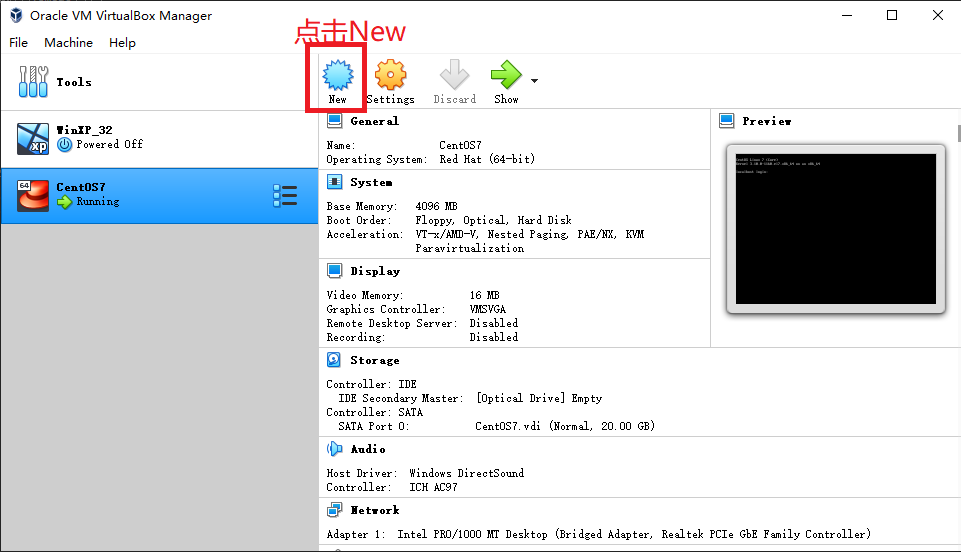

    * 输入操作系统相关信息,并点击Next

        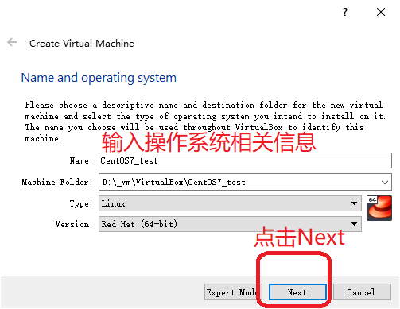
    
    * 给虚拟机分配内存

        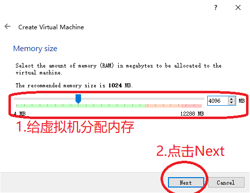

    * 给虚拟机分配硬盘空间

        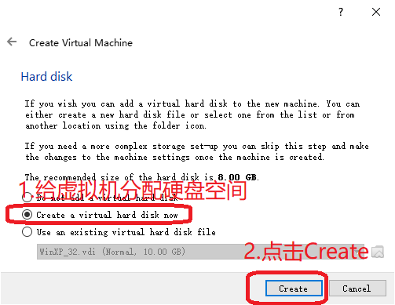

    * 选择硬盘文件类型

        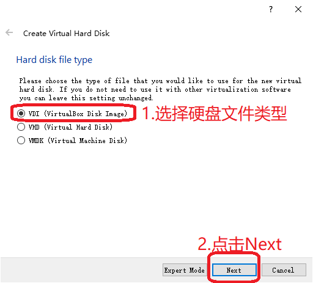

    * 选择动态分配物理硬盘空间

        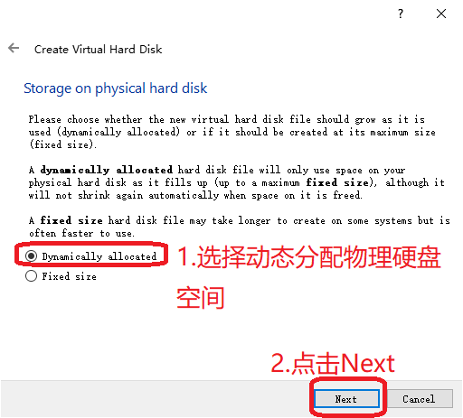

    * 选择虚拟机硬盘文件存储位置以及大小

        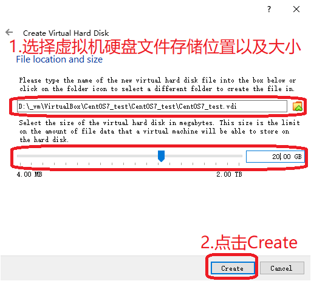

    * 选择创建好的虚拟机

        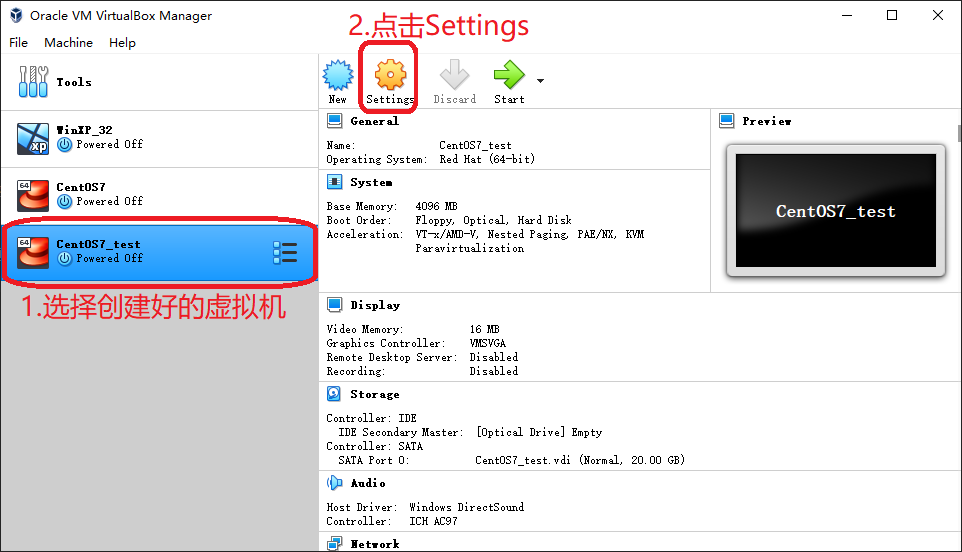

    * 设置虚拟机网络为桥接模式

        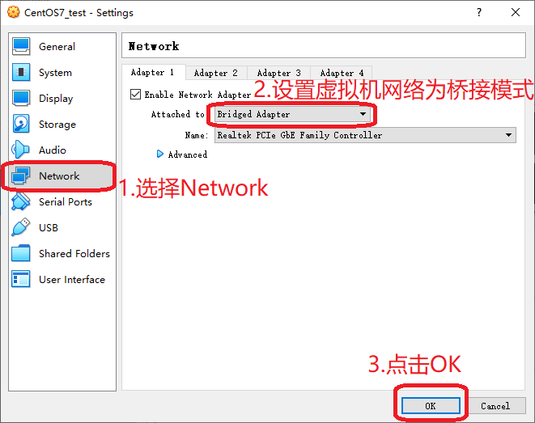

    * 设置系统启动盘用来安装操作系统的ISO文件
        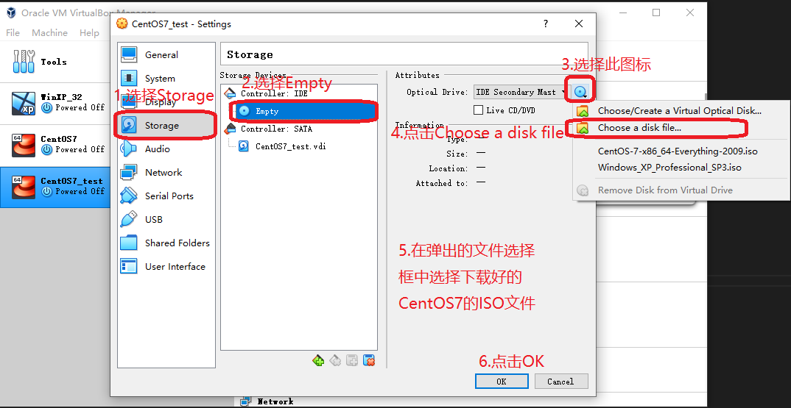

    * 点击Start启动虚拟机

        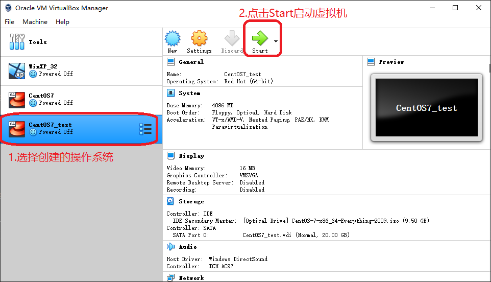
    
    * 点击Start

        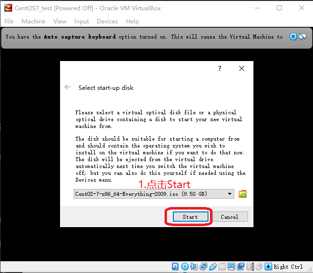
    
    * 选择安装CentOS7

        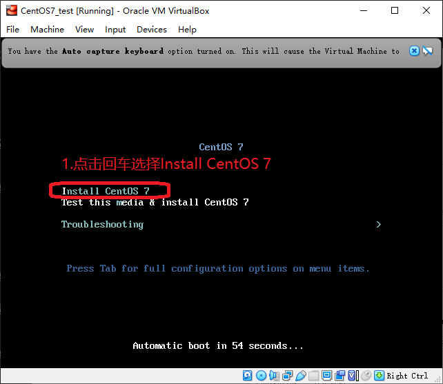
    
    * 选择英语和美式键盘

        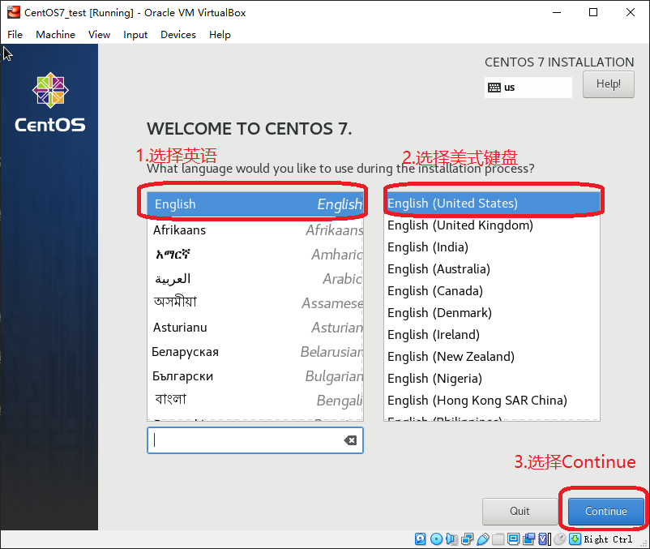

    * 选择Capture捕捉鼠标

        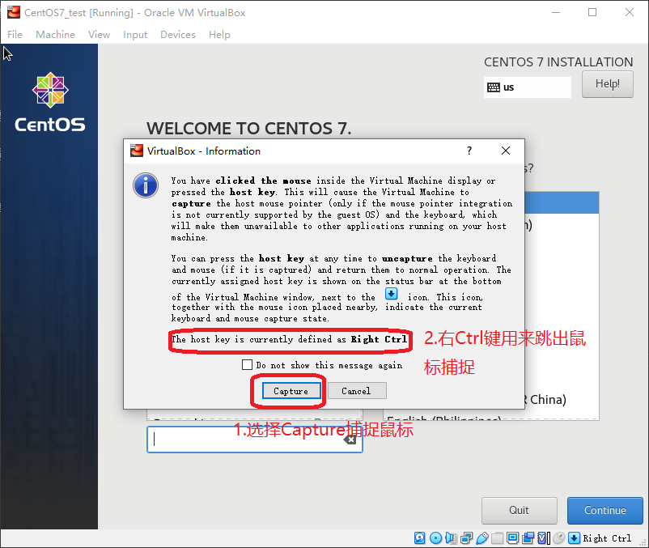

    * 点击CentOS7的安装位置

        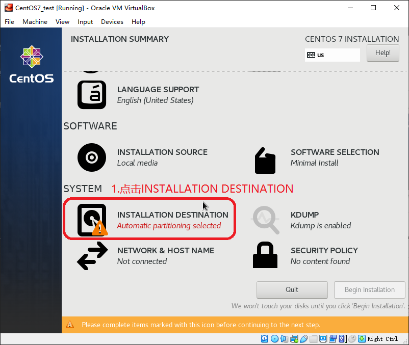

    * 点击Done完成分区设置

        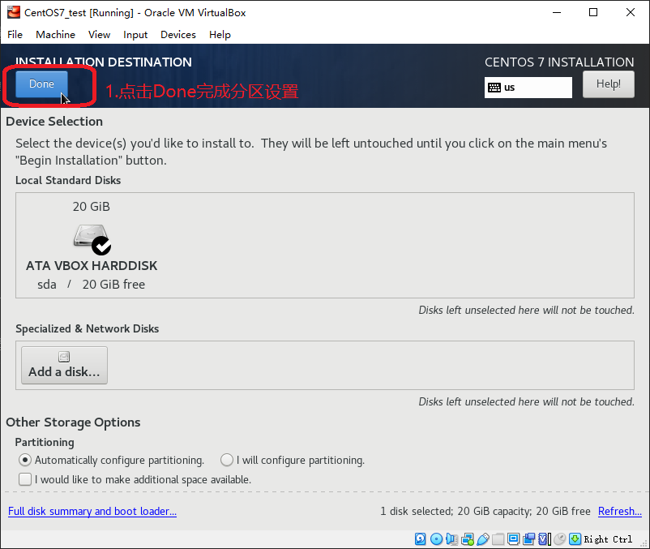

    * 点击BeginInstallation开始安装

        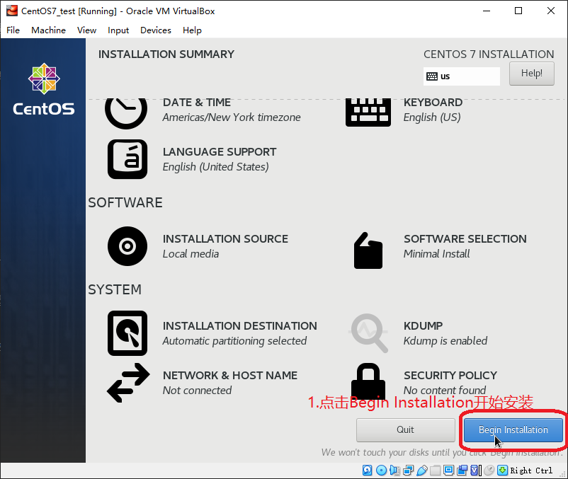

    * 设置root账号密码

        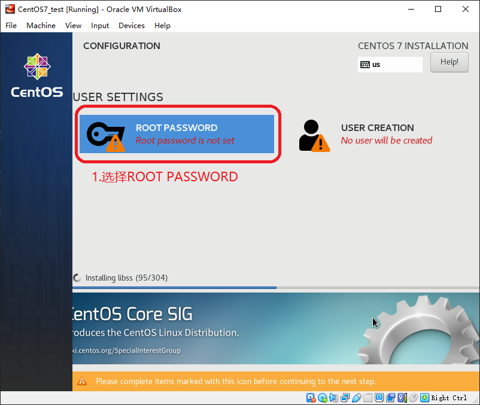

        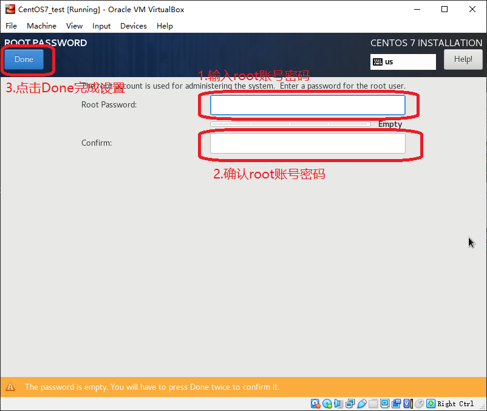

    * 点击Reboot重启虚拟机，完成CentOS7的安装
    
        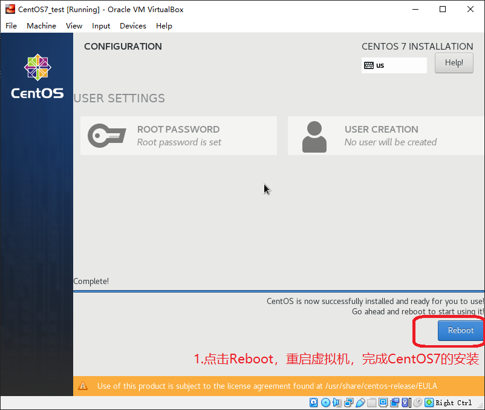

## 设置CentOS7

### 配置静态IP

* 虚拟机重启后，用root账号登录

* 设置静态IP，bash命令如下
    
    ``` bash
    $ cd /etc/sysconfig/network-scripts
    $ ls
    $ vi ifcfg-enp0s3
    ```
    进入vi后，点击i键进入Insert模式，修改ifcfg-enp0s3中的内容如下：

    ``` txt
    BOOTPROTO=static # 将默认的dhcp改为static
    ONBOOT=yes # 将默认的no改为yes

    # 以下是新增的内容
    IPADDR=10.244.186.85
    NETMASK=255.255.255.0
    GATEWAY=10.244.186.1
    ```
    
    修改完成后，点击Esc推出Insert模式,然后输入 :wq 用来退出vi
    
    重置网络配置

    ``` bash
    $ service network restart
    ```

    查看网络配置

    ``` bash
    $ ip addr
    ```
    CentOS7的静态IP配置完成

### 安装远程连接工具

* 安装PuTTY [PuTTY官网地址](https://www.putty.org/) ，[PuTTY下载地址](https://the.earth.li/~sgtatham/putty/latest/w64/putty-64bit-0.74-installer.msi)

* 安装WinSCP [WinSCP官网地址](https://winscp.net/eng/docs/lang:chs) ，[WinSCP下载地址](https://winscp.net/eng/download.php)

* 使用PuTTY通过SSH访问CentOS7

    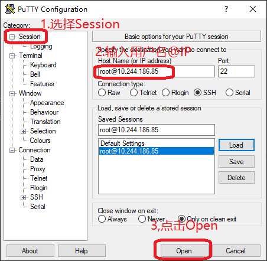

* 使用WinSCP通过SFTP访问CentOS7

   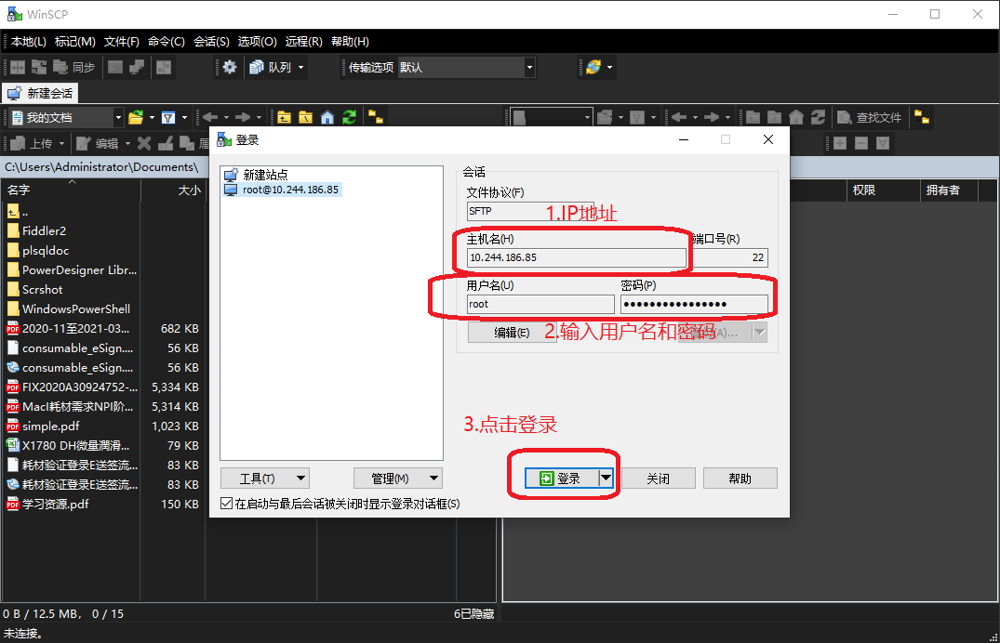

### 设置网络代理

* profile设置代理

编辑/etc/profile

``` bash
$ vi /etc/profile
```

profile中添加以下信息

``` txt
http_proxy=http://10.244.186.81:8088/
export http_proxy
```

生效配置

``` bash
$ source /etc/profile
```

* yum设置代理

编辑/etc/yum.conf

``` bash
$ vi /etc/yum.conf
```

yum.conf中添加以下信息

``` txt
proxy=http://10.244.186.81:8088/
```

编辑/root/.bashrc

``` bash
$ vi /root/.bashrc
```

.bashrc中添加以下信息

``` txt
export http_proxy="http://10.244.186.81:8088/"
```

* wget设置代理

编辑/etc/wgetrc

``` bash
$ vi /etc/wgetrc
```

wgetrc中添加以下信息

``` txt
http_proxy=http://10.244.186.81:8088/
```

* 重启服务器

``` bash
$ reboot
```

## 安装GitLab

* 查看CentOS 版本信息

``` bash
$ cat /etc/centos-release
```

* 查看IP地址

``` bash
ip addr
```

* 安装依赖

``` bash
$ yum install curl policycoreutils-python openssh-server deltarpm -y
```
* 查看防火墙放行列表

``` bash
$ firewall-cmd --list-all
```

* 防火墙放行80，443端口

``` bash
$ firewall-cmd --zone=public --add-port=80/tcp --permanent
$ firewall-cmd --zone=public --add-port=443/tcp --permanent
```

* 重启防火墙

``` bash
$ firewall-cmd --reload
```

* 新增GitLab的国内清华大学的yum源
    * 清华大学YUM源地址 [https://mirrors.tuna.tsinghua.edu.cn/gitlab-ce/yum/el7/](https://mirrors.tuna.tsinghua.edu.cn/gitlab-ce/yum/el7/)
    * 清华大学GitLab Community Edition 镜像使用帮助 [https://mirrors.tuna.tsinghua.edu.cn/help/gitlab-ce/](https://mirrors.tuna.tsinghua.edu.cn/help/gitlab-ce/)

* 新建/etc/yum.repos.d/gitlab-ce.repo, 内容如下

``` txt
[gitlab-ce]
name=Gitlab CE Repository
baseurl=http://mirrors.tuna.tsinghua.edu.cn/gitlab-ce/yum/el$releasever/
gpgcheck=0
enabled=1
```

* 添加命令

``` bash
$ vi /etc/yum.repos.d/gitlab-ce.repo
```

* 查找yum源中gitlab-ce的版本

``` bash
$ yum list gitlab-ce --showduplicates|tail -n 30|head
```

* 选择安装版本(2020-12-17当前最新版本为13.3.7-ce.0.el7)

``` bash
$ yum install gitlab-ce-13.3.7 -y
```

* 查看Gitlab版本

``` bash
$ cat /opt/gitlab/embedded/service/gitlab-rails/VERSION
```

* 配置GitLab配置文件/etc/gitlab/gitlab.rb

``` bash
$ vi /ect/gitlab/gitlab.rb
```
修改以下内容

``` txt
# 将原来的 external_url 'http://gitlab.example.com' 修改为以下内容
external_url 'http://10.244.186.85'
```

* 加载Gitlab的配置

``` bash
$ gitlab-ctl reconfigure
```
当最后出现 gitlab Reconfigured 表明配置成功

* 启动Gitlab

``` bash
$ systemctl start gitlab-runsvdir
$ gitlab-ctl start
```

* 访问 [http://10.244.186.85](http://10.244.186.85) 提示输入密码, 这里输入的是root账号的密码，切记不要乱输，不然就只有通过修改数据库的数据来修改root账号的密码了

* 注册一个非root账号登录，用来创建项目

## 安装JDK1.8

* 过程略

## 安装Maven

* 过程略

## 安装Tomcat

* 安装过程略

* 在conf/Catalina/localhost/文件夹下创建manager.xml，内容如下

``` xml
<?xml version="1.0" encoding="UTF-8"?>
<Context privileged="true" antiResourceLocking="false"
         docBase="${catalina.home}/webapps/manager">
             <Valve className="org.apache.catalina.valves.RemoteAddrValve" allow="^.*$" />
</Context>
```

* 配置manager-script角色的用户，在conf/tomcat-users.xml中添加以下内容:

``` xml
<role rolename="manager-script"/>
<user username="scriptManager" password="scriptManager" roles="manager-script"/>
```

## 安装GitLab-Runner

* Windows 10 操作系统下载GitLab-Runner, [windows下Gitlab Runner官网地址](https://docs.gitlab.com/runner/install/windows.html), [直接下载地址](https://gitlab-runner-downloads.s3.amazonaws.com/latest/binaries/gitlab-runner-windows-amd64.exe)

* 将下载好的gitlab-runner-windows-amd64.exe改为gitlab-runner.exe

* 在gitlab-runner.exe文件夹下打开cmd,输入以下命令，进入交互式注册

``` bash
$ ./gitlab-runner.exe register
```

* 交互式注册如下

``` bash
1.Enter the GitLab instance URL (for example, https://gitlab.com/):
# 输入gitlab的网址
http://10.244.186.85/

2. Enter the registration token:
# 登录root账号进入http://10.244.186.85/admin/runners，找到shared Runner的token并输入（这里以Shared Runner为例）
VRBZQhtZwSr8EpfN1wge

3.Enter a description for the runner:
# 输入此runner的描述
86_win10_shared

4.Enter tags for the runner (comma-separated):
# 输入此Runner的tags
86_win10_shared

5.Enter an executor: parallels, ssh, virtualbox, kubernetes, docker-windows, docker, docker-ssh, shell, docker+machine, docker-ssh+machine, custom:
# 输入executor的类型，选择shell, （Windows操作系统下的有效shell为PowerShell）
shell

```

* 安装gitlab-runner

``` bash
$ ./gitlab-runner.exe install
```

* 启动gitlab-runner，到此gitlab-runner就安装启动成功了

``` bash
$ ./gitlab-runner.exe start
```

* 停止gitlab-runner(当需要停止时才使用)

``` bash
$ ./gitlab-runner.exe stop
```

* 卸载gitlab-runner（当需要卸载时才使用）

``` bash
$ ./gitlab-runner.exe uninstall
```

## 安装Git

* 过程略

## 创建SpringBoot项目

* 过程略

* 项目中添加.gitlab-ci.yml文件，内容如下：

``` yml
build1:
  stage: build
  script:
    # maven打包
    - mvn clean package
    # 以下为PowerShell中的相关文件操作命令，主要是先删除tomcat中的war包和项目文件夹，然后把打包好的war包复制到tomcat的webapps文件夹下
    - new-item -path D:\_dev_env\apache-tomcat-8.5.59\webapps\portal.war -itemtype file -force
    - remove-item -path D:\_dev_env\apache-tomcat-8.5.59\webapps\portal.war
    - new-item -path D:\_dev_env\apache-tomcat-8.5.59\webapps\portal -itemtype directory -force
    - remove-item -path D:\_dev_env\apache-tomcat-8.5.59\webapps\portal -recurse
    - copy-item -path ./target/portal.war -destination D:\_dev_env\apache-tomcat-8.5.59\webapps -force
  after_script:
    # http://localhost:8080/manager/text/reload?path=/portal 这个uri为该项目在tomcat中的reload地址，portal是项目名，注意修改为自己的项目名
    # scriptManager:scriptManager 为tomcat中配置的manager-script角色的用户scriptManager账号和密码
    # invoke-webrequest是PowerShell中的url请求命令，类似与Linux bash中curl命令，整行命令的作用：请求该项目重启的url从而使整个项目重启，作用类似与在html中点击该项目的重载按钮
    - invoke-webrequest -Uri 'http://localhost:8080/manager/text/reload?path=/portal' -Headers @{ Authorization = "Basic " + [System.Convert]::ToBase64String([System.Text.Encoding]::ASCII.GetBytes("scriptManager:scriptManager")) }
  tags:
    # 这里的tags是之前在gitlab-runner交互式注册时填写的tags
    - 86_win10_shared
  only:
    # 这里的master指的是git代码仓库中的master分支的代码变动才触发gitlab-runner
    - master
```

## 使用Git将代码push到GitLab

* 过程略