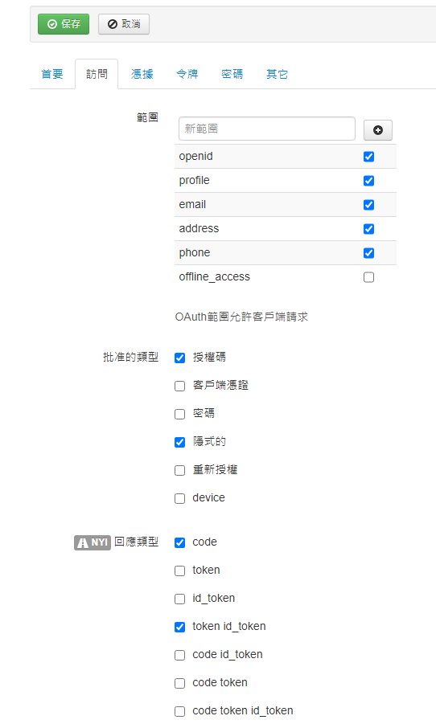

# OpenID-Connect配置与使用

## 目录

* [参考网址](#参考网址)
* [OpenID-Connect协议](#OpenID-Connect协议)
* [名词解释](#名词解释)
* [OpenID-Connect抽象流程](#OpenID-Connect抽象流程)
* [OpenID-Connect的三种认证流程](#OpenID-Connect的三种认证流程)
* [单页应用的OpenID-Connect设置](#单页应用的OpenID-Connect设置)
* [后端通过access-token获取用户信息接口](#后端通过access-token获取用户信息接口)

## 参考网址

> * [官网 OpenID Connect](https://openid.net/connect/)
> * [MITREid Connect(OpenID Connect协议的Java实现)的GitHub网址](https://github.com/mitreid-connect)

## OpenID-Connect协议

什么是OpenID Connect?

OpenID Connect 1.0是一个简单的身份层，它基于OAuth 2.0协议。它允许客户端通过授权服务器执行认证过程去核实终端用户的身份，也同时通过交互式的REST-like风格去获取终端用户的基本简单的信息。

OpenID Connect允许所有类型的客户端，包括web端、移动端、JavaScript端，去请求和接收已认证的Session和终端用户信息。
OpenID Connect的整套技术规范是可扩展的，它允许加入可选择的特性，比如身份加密、OpenID Provider的服务发现、Session管理等，有些时候这些额外的特性对你的项目非常有意义和必要。

## 名词解释

* RP：Relying Part，依赖部分，即客户端
* OP: OpenID Provider，OpenID提供者，即服务端
* UserInfo Endpoint: 用户信息端点，提供用户信息的服务，通常OP服务器中集成了UserInfo Endpoint的功能

## OpenID-Connect抽象流程

1. RP客户端发送请求到OP服务器
2. OP服务器认证用户并获取用户的授权
3. OP服务器返回ID Token和Access Token
4. RP客户端发送Access Token给OP服务器的UserInfo Endpoint服务
5. OP服务器的UserInfo Endpoint服务返回用户的信息

抽象流程图如下：

``` txt
+--------+                                   +--------+
|        |                                   |        |
|        |---------(1) AuthN Request-------->|        |
|        |                                   |        |
|        |  +--------+                       |        |
|        |  |        |                       |        |
|        |  |  End-  |<--(2) AuthN & AuthZ-->|        |
|        |  |  User  |                       |        |
|   RP   |  |        |                       |   OP   |
|        |  +--------+                       |        |
|        |                                   |        |
|        |<--------(3) AuthN Response--------|        |
|        |                                   |        |
|        |---------(4) UserInfo Request----->|        |
|        |                                   |        |
|        |<--------(5) UserInfo Response-----|        |
|        |                                   |        |
+--------+                                   +--------+
```

## OpenID-Connect的三种认证流程

OpenID Connect提供了三种认证流程，如下：
* 授权码流程
* 隐式流程
* 混合流程
特定的流程决定了ID Token和Access Token返回给客户端的方式，根据自己的项目特点选择其中的一种流程。

三种流程的特点

| 特点 | 授权码流程 | 隐式流程 | 混合流程 |
| ---- | ---- | ---- | ---- |
| 所有的token都从Authorization Endpoint返回 | no | yes | no |
| 所有token都从Token Endpoint返回 | yes | no | no |
| token不透露User Agent | yes | no | no |
| 客户端能被认证 | yes | no | yes |
| 可用Refresh Token | yes | no | yes |
| 客户端和服务器只需要一轮通信 | no | yes | no |
| 大多数的通信都是服务器对服务器通信 | yes | no | varies(变化) |

****

三种流程的response_type

| response_type值 | 流程类型 |
| ---- | ---- |
| code | 授权码流程 |
| id_token | 隐式流程 | 
| id_token token | 隐式流程 |
| code id_token | 混合流程 |
| code token | 混合流程 |
| code id_token token | 混合流程 |

### 授权码流程

* 当使用授权码流程时，所有的token都从Token Endpoint返回。
* 授权码流程返回授权码给客户端，然后客户端用授权码直接从服务器获取ID Token和Access Token，这样做的好处是不会暴露任何token给User Agent和其他能够访问这些User Agent的可能的恶意应用。
授权服务器也能在通过授权码交换Access Token之前认证客户端。授权码流程适合需要在客户端和授权服务器之间确保客户端密码安全的客户端。

授权码流程步骤：
1. 客户端准备包含了相应请求参数的认证请求
2. 客户端发送认证请求到授权服务器
3. 授权服务器认证用户
4. 授权服务器获取用户授权
5. 授权服务器将用户返回到客户端并带上授权码
6. 客户端后端使用授权码请求授权服务器的Token Endpoint服务
7. 授权服务器的Token Endpoint服务返回ID Token和Access Token给客户端
8. 客户端验证ID Token并获取用户信息

### 隐式流程

* 当使用隐式流程时，所有token都从Authorization Endpoint返回，Token Endpoint没有被使用。
* 隐式流程主要用于使用脚本语言在浏览器里实现地客户端。Access Token和ID Token都直接返回到客户端，这样可能会将这两种token暴露给用户和那些能够访问用户User Agent的应用。
授权服务器没有执行客户端认证的过程。

隐式流程步骤：
1. 客户端准备好包含有需求要请求的参数的认证请求
2. 客户端发送认证请求到授权服务器
3. 授权服务器认证用户
4. 授权服务器获取用户授权
5. 授权服务器返回ID Token和Access Token给客户端
6. 客户端验证ID Token并获取用户信息

### 混合流程

* 当使用混合流程时，一些token是从Authorization Endpoint返回，另一些是从Token Endpoint返回。

混合流程的步骤：
1. 客户端准备好包含需要请求的参数的认证请求
2. 客户端发送认证请求到授权服务器
3. 授权服务器认证用户
4. 授权服务器获取用户授权
5. 授权服务器将用户返回到客户端，并带上授权码，依据响应的类型，携带一个或多个额外的参数(这里的参数就是可以直接从授权服务器获取的token，
能从授权服务器中直接获取token，这就是和授权码流程的区别)
6. 客户端将授权码发送到Token Endpoint
7. 客户端获取Token Endpoint返回的ID Token和Access Token
8. 客户端验证ID Token并获取用户信息

## 单页应用的OpenID-Connect设置

根据前面隐式流程的特性看出，单页应用非常符合隐式流程，所以前端是单页应用的系统或项目可以直接使用隐式流程，优点是配置简单且使用方便，缺点是暴露了各种token，显得不那么安全。
如果系统对安全要求较高的话，还是老老实实用授权码方式，所有的token都是在后端流转，前端只能够看到重定向的授权码，且所有的权限都由后端的SpringSecurity来管理。

Portal项目中的OpenID Connect客户端的实现思路如下，小伙伴们可以参考：
1. OpenID Connect服务器中设置客户端使用隐式流程如下图，所有的跳转都交给前端

2. 后端只负责通过HttpClient用token获取用户信息(因为大多数情况下前端没办法在当前项目中直接用token向授权服务器取用户信息，会涉及到跨域)
3. 前端做好路由的前置守卫，所有前端发起的请求都要经过该守卫，功能类似后端的过滤器或拦截器。
4. 登录成功后将用户信息和token都存放到前端的sessionStorage中，登出后清除sessionStorage中的这些数据。
(我知道你要吐槽这不安全，但是我们的内网项目，其实真的不用太在意这些细节，用户登录状态都交给前端，后端小伙伴们安静地做个增删改查接口仔，不香么，前端都用单页应用了，已经是前后分离了，把MVC都交给前端吧)
5. 其实重点在路由前置守卫，感觉讲不清楚，直接贴代码吧

大致实现思路如下：
a. 根据sessionStorage中的用户信息和access_token的有无判断用户是否登录，
b. 没有登录就跳转到OpenID Connect的授权地址, 如果未在OpenID Connect中登录，就会跳转到登录页面,
c. 用户登录成功后会重定向回设置的地址，然后在该地址会携带access_token返回，从url中获取access_token的值，
d. 调用后端的接口获取用户信息，然后将用户信息和access_token保存到sessionStorage中。

### React的实现

``` javascript
function getUrlParam (param:any) {
  var reg = new RegExp("(^|&)" + param + "=([^&]*)(&|$)");
  var r = window.location.hash.substr(1).match(reg);
  if (r != null) return decodeURI(r[2]);
  return null;
}

export async function  render(oldRender:any) {
  let access_token = sessionStorage.getItem('access_token')
  let access_token_hash = getUrlParam('access_token');
  if (!access_token) {
    if (!access_token_hash) {
      const url = window.location.origin + "/portal";
      const loginUrl = encodeURIComponent(url)
      window.location.href = 'http://10.244.168.180/openid/authorize?response_type=token%20id_token' +
      '&client_id=MacIPortal' +
      '&redirect_uri=' + loginUrl
      '&scope=openid%20profile' + 
      '&state=' + Math.round(Math.random()*1e14 + 1e15).toString(16) +
      '&nonce=' + Math.round(Math.random()*1e14 + 1e15).toString(16);
    } else {
      if(!sessionStorage.getItem("user")){
        sessionStorage.setItem("access_token",getUrlParam('access_token')||'')
        sessionStorage.setItem("token_type",getUrlParam('token_type')||'')
        sessionStorage.setItem("id_token",getUrlParam('id_token')||'')
        sessionStorage.setItem("expires_in",getUrlParam('expires_in')||'')
        sessionStorage.setItem("state",getUrlParam('state')||'')
        let user = await getUserInfo();
        sessionStorage.setItem("user",JSON.stringify(user))
      }
      oldRender()
    }
  }else{
    oldRender()
  }
}
```

### Vue的实现

``` javascript
// router/index.js
// router中的前置守卫
  const routes = [
  {
    path: '/',
    name: 'Home',
    component: Home
  },
  {
    path: '/openid_connect_login',
    name: 'OpenIdConnectLogin',
    component: () => import('../views/OpenIdConnectLogin.vue')
  },
  {
    path: '/about',
    name: 'About',
    component: () => import('../views/About.vue')
  },
  {
    path: '/authorize',
    name: 'authorize',
    component: () => import('../views/About.vue')
  },
  {
    path: '*',
    redirect: '/',// 重定向规则放在路由表的最底部，当前面所有的路由都没有匹配到时，会进入此重定向规则，重定向到首页
  },
]

const router = new VueRouter({
  mode: 'history',
  base: process.env.BASE_URL,
  routes
})

router.beforeEach((to, from, next) => {
  let userInfo = sessionStorage.getItem('userInfo');
  let access_token = sessionStorage.getItem('access_token');

  if (to.path === '/authorize' || to.path === '/openid_connect_login') {
    next();
  } else {
    if (userInfo === null || access_token === null || access_token === '') {
      next('/authorize');
    } else {
      next();
    }
  }
});

// /authorize路由中的跳转方法
authorize () {
  window.location.href = 'http://10.244.168.180/openid/authorize?response_type=token%20id_token' +
'&client_id=MacIPortal' +
'&redirect_uri=http%3A%2F%2Flocalhost%3A8080%2Fportal%2Fopenid_connect_login' +
'&scope=openid%20profile' + 
'&state=' + Math.round(Math.random() * (1e16 - 1e15) + 1e15).toString(16) +
'&nonce=' + Math.round(Math.random() * (1e16 - 1e15) + 1e15).toString(16);
},

// /openid_connect_login路由获取登录用户
export default {
  name: 'OpenIdConnectLogin',
  props: {
    msg: String
  },
  data: function () {
    return {
      userInfo: '',
      access_token: '',
      token_type: '',
      id_token: '',
      expires_in: '',
      state: '',
    };
  },
  computed: {
    
  },
  methods: {
    getUrlParam (param) {
      var reg = new RegExp("(^|&)" + param + "=([^&]*)(&|$)");
      var r = window.location.hash.substr(1).match(reg);
      if (r != null) return decodeURI(r[2]);
      return null;
    },
    getUserInfo () {
        this.axios({
          method: 'GET',
          url: '/portal/userInfo/loginUser',
          headers: {'Authorization': 'Bearer ' + this.access_token},
          withCredentials: true
        }).then(response => {
          window.console.log(response.data);
          let result = response.data;
          if (result.code != '1') {
            alert('未登录或登录失效，请登录');
            this.$router.push('authorize');
          } else {
            window.console.log(result.msg);
            this.userInfo = result.data;

            sessionStorage.setItem('userInfo', this.userInfo);
            sessionStorage.setItem('access_token', this.access_token);
            sessionStorage.setItem('token_type', this.token_type);
            sessionStorage.setItem('id_token', this.id_token);
            sessionStorage.setItem('expires_in', this.expires_in);
            sessionStorage.setItem('state', this.state);

            alert('登录成功');
            this.$router.push('/');
          }
        });
    },
  },
  created: function () {
    this.access_token = this.getUrlParam('access_token');
    this.token_type = this.getUrlParam('token_type');
    this.id_token = this.getUrlParam('id_token');
    this.expires_in = this.getUrlParam('expires_in');
    this.state = this.getUrlParam('state');

    if (this.access_token === null || this.access_token === '') {
      alert('没有access_token');
      this.$router.push('authorize');
    } else {
      this.getUserInfo();
    }
  }
}
```

## 后端通过access-token获取用户信息接口

大致实现思路：
1. 通过拦截器去拦截有特定注解的请求(携带token的请求都需要使用特定的注解)
2. 从请求头中获取token
3. 使用HttpClient工具类去请求OpenID Connect的userinfo服务，从而获取用户信息

这里贴出拦截器和HttpClient工具类的核心代码

### 拦截器

``` java
// AuthInterceptor.java 拦截器

package com.foxconn.mcebg.portal.interceptor;

import com.foxconn.mcebg.portal.oidc.model.UserInfo;
import com.foxconn.mcebg.portal.util.HttpClientUtil;
import com.foxconn.mcebg.portal.util.VerifyToken;
import org.springframework.web.method.HandlerMethod;
import org.springframework.web.servlet.HandlerInterceptor;

import javax.servlet.http.HttpServletRequest;
import javax.servlet.http.HttpServletResponse;
import javax.servlet.http.HttpSession;
import java.lang.reflect.Method;

public class AuthInterceptor implements HandlerInterceptor {

    @Override
    public boolean preHandle(HttpServletRequest request, HttpServletResponse response, Object handler) throws Exception {
        // 获取access_token
        String authorization = request.getHeader("Authorization");
        // 如果不是映射到Controller方法直接放行
        if(!(handler instanceof HandlerMethod)) {
            return true;
        }
        HandlerMethod handlerMethod = (HandlerMethod) handler;
        Method method = handlerMethod.getMethod();
        // 檢查需不需要access_token
        if(method.isAnnotationPresent(VerifyToken.class)) {
            VerifyToken verifyToken = method.getAnnotation(VerifyToken.class);
            if(verifyToken.required()) {
                if(authorization == null || "".equals(authorization)) {
                    throw new RuntimeException("请求头中必须包含Authorization，axios请求参考 headers: {'Authorization': 'Bearer ' + this.access_token}");
                }

                int indexBearer  = authorization.indexOf("Bearer ");
                if (indexBearer != 0) {
                    throw new RuntimeException("请求头中Authorization的值的格式必须为'Bearer ' + this.access_token");
                }
                String header_access_token = authorization.substring("Bearer ".length());
                if (header_access_token == null || "".equals(header_access_token)) {
                    throw new RuntimeException("请求头的Authorization中必须包含access_token，axios请求参考 headers: {'Authorization': 'Bearer ' + this.access_token}");
                }

                HttpSession session = request.getSession();
                String session_access_token = (String) session.getAttribute("access_token");
                if (session_access_token != null && !"".equals(session_access_token) && header_access_token.equals(session_access_token)) {
                    return true;
                } else {
                    UserInfo userInfo = HttpClientUtil.getUserInfo(header_access_token);
                    if (userInfo == null) {
                        throw new RuntimeException("未登录或登录失效，请登录");
                    }

                    session.setAttribute("access_token", header_access_token);
                    session.setAttribute("userInfo", userInfo);
                }

                return true;
            }
        }

        return true;
    }

}

```

### HttpClient工具类

``` java
// HttpClientUtil.java HttpClient工具类

package com.foxconn.mcebg.portal.util;

import com.foxconn.mcebg.portal.oidc.model.DefaultUserInfo;
import com.foxconn.mcebg.portal.oidc.model.UserInfo;
import com.google.common.base.Strings;
import com.google.gson.JsonObject;
import com.google.gson.JsonParser;
import lombok.extern.slf4j.Slf4j;
import org.apache.http.client.HttpClient;
import org.apache.http.impl.client.HttpClientBuilder;
import org.springframework.http.HttpMethod;
import org.springframework.http.client.ClientHttpRequest;
import org.springframework.http.client.HttpComponentsClientHttpRequestFactory;
import org.springframework.web.client.RestTemplate;

import java.io.IOException;
import java.net.URI;

@Slf4j
public class HttpClientUtil {
    private static HttpClient httpClient;
    private static HttpComponentsClientHttpRequestFactory factory;

    static {
        httpClient = HttpClientBuilder.create().useSystemProperties().build();
        factory = new HttpComponentsClientHttpRequestFactory(httpClient);
    }

    // 获取UserInfo
    public static UserInfo getUserInfo(String access_token) throws Exception {
        String userInfoString = null;

        RestTemplate restTemplate = new RestTemplate(factory) {
            @Override
            protected ClientHttpRequest createRequest(URI url, HttpMethod method) throws IOException {
                ClientHttpRequest httpRequest = super.createRequest(url, method);
                httpRequest.getHeaders().add("Authorization", String.format("Bearer %s", access_token));
                return httpRequest;
            }
        };
        userInfoString = restTemplate.getForObject("http://10.244.168.180/openid/userinfo", String.class);

        if (!Strings.isNullOrEmpty(userInfoString)) {
            JsonObject userInfoJson = new JsonParser().parse(userInfoString).getAsJsonObject();
            UserInfo userInfo = fromJson(userInfoJson);

            return userInfo;
        } else {
            // didn't get anything throw exception
            throw new IllegalArgumentException("Unable to load user info");
        }
    }

    protected static UserInfo fromJson(JsonObject userInfoJson) {
        return DefaultUserInfo.fromJson(userInfoJson);
    }
}

```